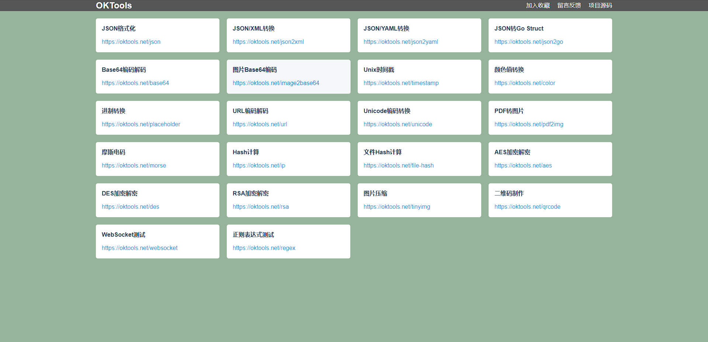

# 一个工具网站


# 编译
1. 安装 Golang
2. 安装 Git
3. 构建
```shell
git clone https://github.com/wangyiwy/oktools.git
cd oktools
go build
```
4. 修改配置文件
```shell
mv conf.yaml.default conf.yaml
vi conf.yaml
```
配置说明
```shell
app:
  mode: release # debug / release 
  log-file: oktools.log # 日志文件路径

http:
  port: 443 # 程序端口
  ssl: # ssl 证书配置 , release 模式必须
    crt:  # example: /etc/oktools/oktools.net_nginx/oktools.net_bundle.crt
    key:  # example: /etc/oktools/oktools.net_nginx/oktools.net.key
```
6. 运行
```shell
sh start.sh
```
7. 停止
```shell
sh stop.sh
```